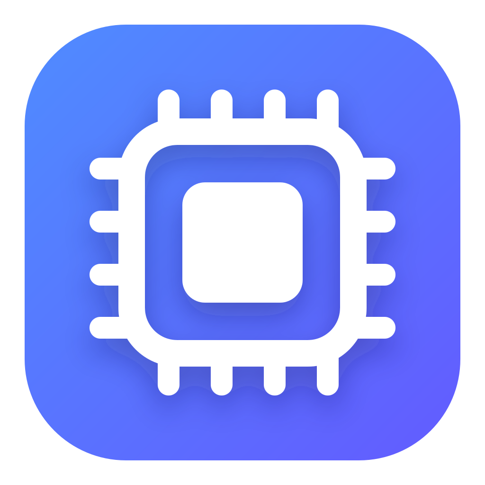

# SwapAlert

<p align="center">
  
</p>

macOSの累積`swapouts`カウンタを監視し、新しいメモリスワップが発生したときに通知する軽量なメニューバーアプリです。起動前に発生した過去のスワップでは通知しません。

## 機能

- 2秒、5秒、10秒、30秒から監視間隔を選択
- 新しいswapoutのページ数と推定サイズを通知
- 現在のスワップ使用量と最終検知時刻を表示
- 監視の一時停止とテスト通知
- Dockに表示されないメニューバー専用UI
- 外部通信、分析、個人データ収集なし

## 動作条件

- macOS 13 Ventura以降
- ビルドする場合はXcode Command Line Tools
- 配布バイナリはApple Silicon（arm64）向け

## インストール

Releasesから最新版のZIPをダウンロードして展開し、`SwapAlert.app`をアプリケーションフォルダへ移動してください。初回起動時に通知許可ダイアログが表示された場合は「許可」を選択します。

## ビルド

```sh
chmod +x scripts/build_app.sh
./scripts/build_app.sh
open dist/SwapAlert.app
```

生成物は`dist/SwapAlert.app`です。アプリはDockには表示されず、メニューバーのメモリチップアイコンから操作できます。

Apple Developer証明書を持たないローカルビルドでは、macOSが`UserNotifications`への登録を拒否します。その場合はApple署名済みの`osascript`を使うmacOS内蔵通知へ自動的に切り替わります。通知タイトルと本文はJXAコードへ埋め込まず、個別のプロセス引数として渡します。

## 検知方法

アプリ起動時の`swapouts`値を基準にし、その後2〜30秒ごとに差分を確認します。そのため、起動前に発生したスワップでは通知しません。継続的にスワップが起きている場合も、通知は確認間隔につき最大1回です。

`host_statistics64(HOST_VM_INFO64)`の`swapouts`を利用するため、管理者権限は不要です。`vm.swapusage`が取得できない保護環境でも、swapoutの検知と通知は継続します。
